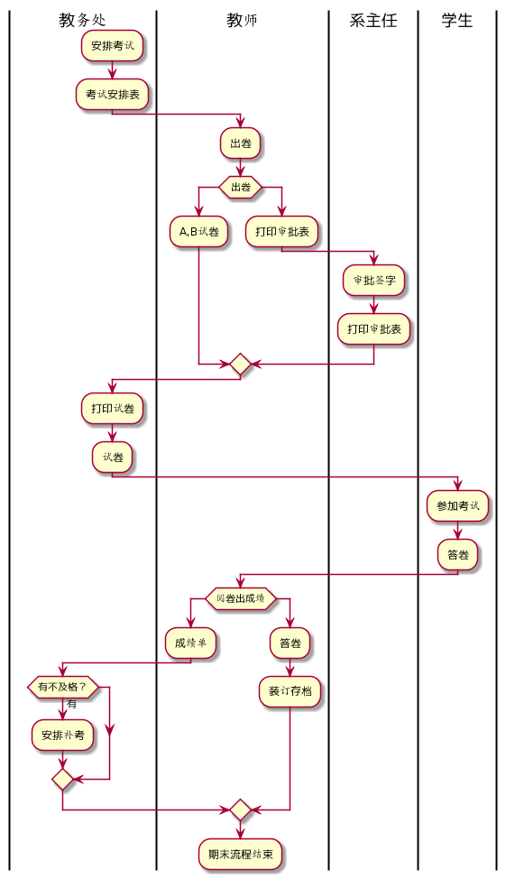
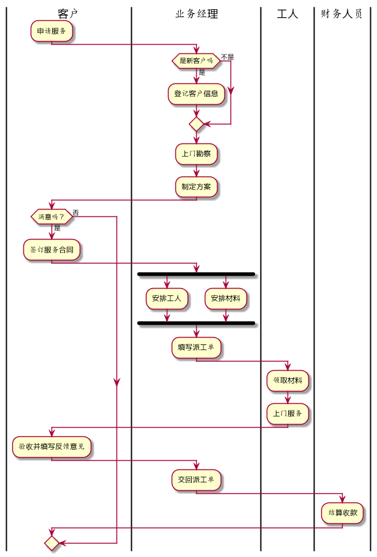

# test1

| 姓名 | 学号         | 专业     | 头像 |
| ---- | ------------ | -------- | ---- |
| 蔡伟 | 201510414201 | 软件工程 |      |

## 流程图1：考试及成绩管理流程

**PlantUML源码如下：**

```
@startuml
|Swimlane1|
:安排考试;
:考试安排表;
|Swimlane2|
:出卷;
if(出卷)
:A,B试卷;
else
:打印审批表;
|Swimlane3|
:审批签字;
:打印审批表;
endif
|Swimlane1|
:打印试卷;
:试卷;
|Swimlane4|
:参加考试;
:答卷;
|Swimlane2|
if(阅卷出成绩)
:成绩单;
|Swimlane1|
if(有不及格？)then(有)
:安排补考;
endif
|Swimlane2|
else
:答卷;
:装订存档;
endif
:期末流程结束;
@enduml
```

**业务流程图如下：**



## 流程图2： 客户维修服务流程

### PlantUML源码如下：

```
@startuml
|客户|
:申请服务;
|业务经理|
if(是新客户吗)then(是)
:登记客户信息;
else(不是)
endif
:上门勘察;
:制定方案;
|客户|
if(满意吗？)then(是)
:签订服务合同;
|业务经理|
fork
    :安排工人;
  fork again
    :安排材料;
  end fork
:填写派工单;
|工人|
:领取材料;
:上门服务;
|客户|
:验收并填写反馈意见;
|业务经理|
:交回派工单;
|财务人员|
:结算收款;
else(否)
@enduml
```

### 业务流程图如下：