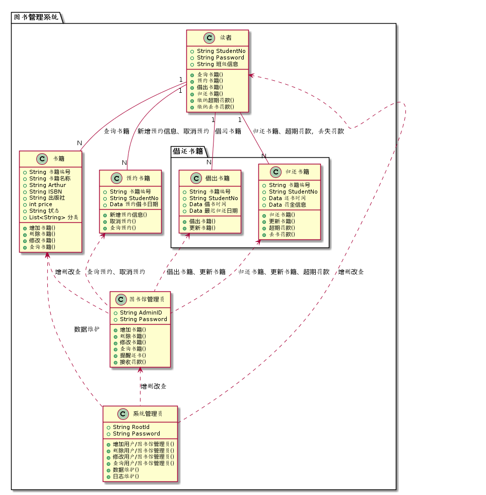
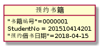
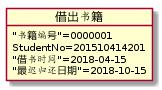
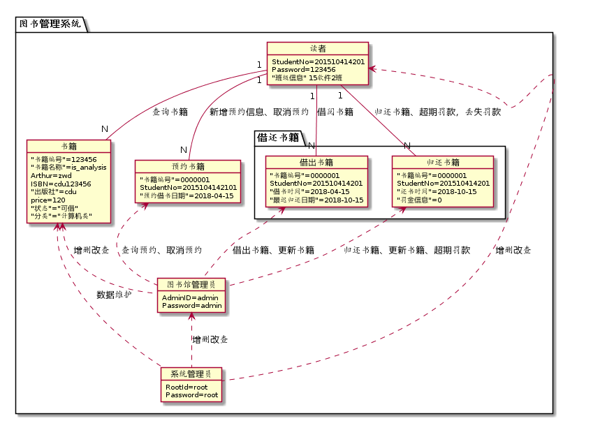

# 实验3：图书管理系统领域对象建模

## 1.图书管理系统类图

**1.1 PlantUML源码如下：**

```
@startuml
package "图书管理系统" {

class 预约书籍 {
  +String 书籍编号
  +String StudentNo
  +Data 预约借书日期

  +新增预约信息()
  +取消预约()
  +查询预约()
}
package "借还书籍" {
class 借出书籍 {
  +String 书籍编号
  +String StudentNo
  +Data 借书时间
  +Data 最迟归还日期
  +借出书籍()
  +更新书籍()
}
class 归还书籍 {
  +String 书籍编号
  +String StudentNo
  +Data 还书时间
  +Data 罚金信息
  +归还书籍()
  +更新书籍()
  +超期罚款()
  +丢书罚款()
}
}
class 书籍 {
   +String 书籍编号
   +String 书籍名称
   +String Arthur
   +String ISBN
   +String 出版社
   +int price
   +String 状态
   +List<String> 分类

   +增加书籍()
   +删除书籍()
   +修改书籍()
   +查询书籍()
}
class 读者 {
   +String StudentNo
   +String Password
   +String 班级信息

   +查询书籍()
   +预约书籍()
   +借出书籍()
   +归还书籍()
   +缴纳超期罚款()
   +缴纳丢书罚款()
}
class 图书馆管理员{
     +String AdminID
     +String Password

     +增加书籍()
     +删除书籍()
     +修改书籍()
     +查询书籍()
     +提醒还书()
     +接收罚款()
 }
class 系统管理员 {
   +String RootId
   +String Password

   +增加用户/图书馆管理员()
   +删除用户/图书馆管理员()
   +修改用户/图书馆管理员()
   +查询用户/图书馆管理员()
   +数据维护()
   +日志维护()
}

读者"1" -- "N"书籍:查询书籍
读者"1" -- "N"预约书籍:新增预约信息、取消预约
读者"1" -- "N"借出书籍:借阅书籍
读者"1" -- "N"归还书籍:归还书籍、超期罚款，丢失罚款

书籍 <.. 图书馆管理员:增删改查
借出书籍 <.. 图书馆管理员:借出书籍、更新书籍
归还书籍 <.. 图书馆管理员:归还书籍、更新书籍、超期罚款
预约书籍 <.. 图书馆管理员:查询预约、取消预约
读者 <.. 系统管理员:增删改查
图书馆管理员 <.. 系统管理员:增删改查
书籍 <.. 系统管理员:数据维护

}
@enduml
```

**1.2 类图：**



## 2.图书管理系统对象图

### 2.1 预约书籍

plantUML源码：

```
@startuml

object 预约书籍{
    "书籍编号"=0000001
    StudentNo = 201510414201
    "预约借书日期"=2018-04-15
}

@enduml

```

预约对象图：



### 2.2 借出书籍

plantUML源码：

```
@startuml

object 借出书籍{
    "书籍编号"=0000001
    StudentNo=201510414201
    "借书时间"=2018-04-15
    "最迟归还日期"=2018-10-15
}

@enduml
```

借出对象图：



### 2.3 图书管理系统

plantUML源码：

```
@startuml
package "图书管理系统" {
    object  预约书籍 {
      "书籍编号"=0000001
      StudentNo=2015104142101
      "预约借书日期"=2018-04-15

    }
package "借还书籍" {
    object  借出书籍 {
      "书籍编号"=0000001
      StudentNo=201510414201
      "借书时间"=2018-04-15
      "最迟归还日期"=2018-10-15

    }
    object  归还书籍 {
      "书籍编号"=0000001
      StudentNo=201510414201
      "还书时间"=2018-10-15
      "罚金信息"=0
    }
}
    object  书籍 {
       "书籍编号"=123456
       "书籍名称"=is_analysis
       Arthur=zwd
       ISBN=cdu123456
       "出版社"=cdu
       price=120
       "状态"="可借"
       "分类"="计算机类"
    }
    object  读者 {
       StudentNo=201510414201
       Password=123456
       "班级信息" 15软件2班

    }
    object  图书馆管理员{
         AdminID=admin
         Password=admin

     }
    object 系统管理员 {
       RootId=root
       Password=root

    }
读者"1" -- "N"书籍:查询书籍
读者"1" -- "N"预约书籍:新增预约信息、取消预约
读者"1" -- "N"借出书籍:借阅书籍
读者"1" -- "N"归还书籍:归还书籍、超期罚款，丢失罚款

书籍 <.. 图书馆管理员:增删改查
借出书籍 <.. 图书馆管理员:借出书籍、更新书籍
归还书籍 <.. 图书馆管理员:归还书籍、更新书籍、超期罚款
预约书籍 <.. 图书馆管理员:查询预约、取消预约
读者 <.. 系统管理员:增删改查
图书馆管理员 <.. 系统管理员:增删改查
书籍 <.. 系统管理员:数据维护
}
@enduml
```

