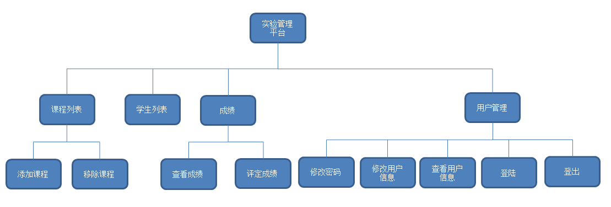
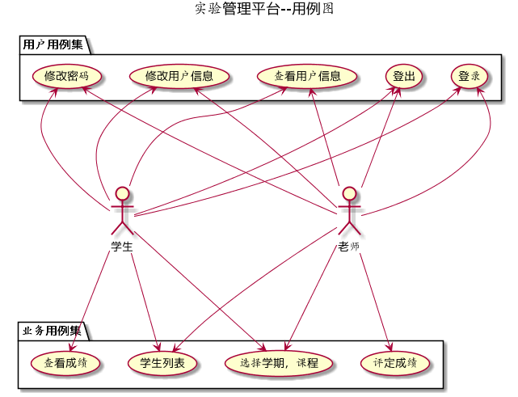
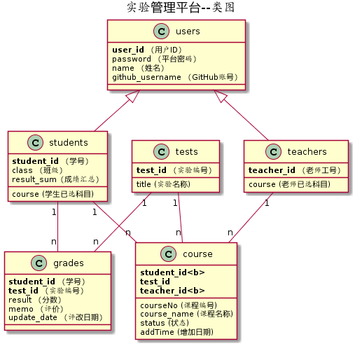

# 基于GitHub的实验管理平台的分析与设计

| 学号         | 班级         | 姓名 |
| ------------ | ------------ | ---- |
| 201510414201 | 软件工程二班 | 蔡伟 |

## 1.概述

- 基于GitHub的实验管理平台的作用是在线管理实验成绩的Web应用系统。学生和老师的实验内容均存放在GitHUB 页面上。
- 学生的功能主要有：一是设置自己的GitHub用户名，二是查询自己的实验成绩。学生的GitHub用户名是公开的，但成绩不公开。
- 老师的功能主要有：一是批改每个学生的成绩，二是查看每个学生的成绩。
- 老师和学生都能通过本系统的链接方便地跳转到学生的每个GitHUB实验目录，以便批改实验或者查看实验情况。
- 实验成绩按数字分数计算，每项实验的满分为100分，最低为0分。
- 系统自动计算每个学生的所有实验的平均分。

## 2.系统总体结构

[页面设计](https://caiweicai.github.io/is_analysis/test6/ui/index.html) 

## 3.用例图设计 [源码](./src/用例图设计.puml) 

## 4.类图 [源码](./src/类图.puml)

## 5.数据库设计

[数据库设计](./数据库.md)

## 6.用例及界面详细设计

- ### [“学生列表”用例](https://github.com/caiweicai/is_analysis/tree/master/test6/用例/学生列表.md)

- ### [“评定成绩”用例](https://github.com/caiweicai/is_analysis/tree/master/test6/用例/评定成绩.md)

- ### [“登出”用例](https://github.com/caiweicai/is_analysis/tree/master/test6/用例/登出.md)

- ### [“登录”用例](https://github.com/caiweicai/is_analysis/tree/master/test6/用例/登出.md)

- ### ["课程选择"用例](https://github.com/caiweicai/is_analysis/tree/master/test6/用例/课程选择.md)

- ### [“登录”用例](https://github.com/zwdbox/is_analysis/blob/master/test6/%E7%94%A8%E4%BE%8B/%E7%99%BB%E5%BD%95.md),[界面](https://zwdbox.github.io/is_analysis/test6/ui/%E7%99%BB%E5%BD%95.html)

- ​