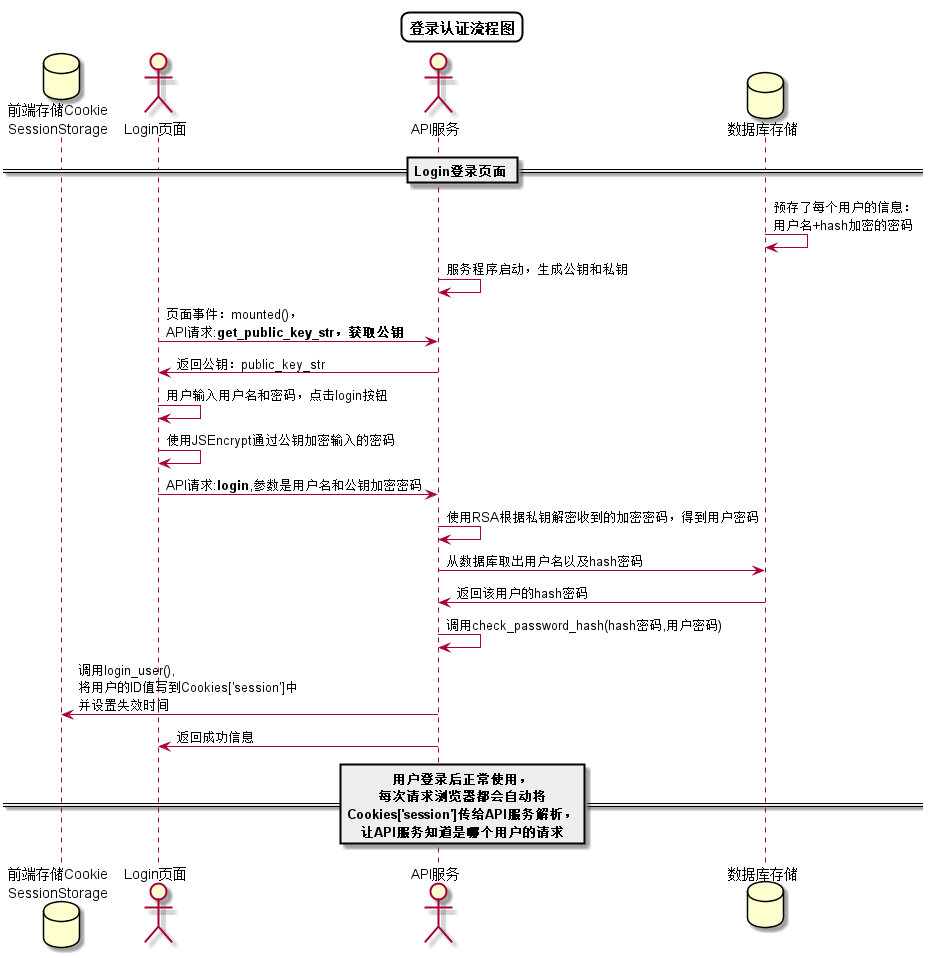

# “修改密码”用例 [返回](https://github.com/caiwei/is_analysis/tree/master/test6/README.md)

## 1. 用例规约

| 用例名称   | 修改密码                                                     |
| ---------- | ------------------------------------------------------------ |
| 功能       | 修改用户的密码                                               |
| 参与者     | 学生，老师                                                   |
| 前置条件   | 必须先登录                                                   |
| 后置条件   | 修改密码以后必须强制登出，再跳转到登录页面                   |
| 主事件流   | 1.用户填写新密码（两次输入） 2.用户提交修改信息 3.系统存储修改后密码 |
| 备选事件流 | 1a. 用户两次输入的密码不同    1.系统提示两次输入的密码不相同    2. 用户重新填写并提交。 |

## 2. 业务流程

## 3. 界面设计

- 界面参照: [https://zwdbox.github.io/is_analysis/test6/ui/顶部菜单.html](https://zwdbox.github.io/is_analysis/test6/ui/%E9%A1%B6%E9%83%A8%E8%8F%9C%E5%8D%95.html)
- API接口调用
  - 接口1：[setPassword](https://github.com/caiweicai/is_analysis/tree/master/test6/用例/setPassword.md)

## 4. 算法描述 [源码](https://github.com/caiweicai/is_analysis/blob/master/test6/src/修改密码.puml)

## 5. 参照表

users

- [数据库设计](https://github.com/caiweicai/is_analysis/blob/master/test6/数据库.md)