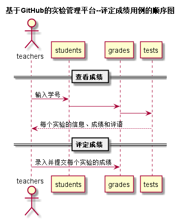

# “评定成绩”用例 [返回](https://github.com/caiweicai/is_analysis/tree/master/test6/README.md)

## 1. 用例规约

| 用例名称   | 评定成绩                                                     |
| ---------- | ------------------------------------------------------------ |
| 功能       | 老师评定一个学生的实验成绩                                   |
| 参与者     | 老师                                                         |
| 前置条件   | 查看成绩：评定成绩之前，老师需要先登录，并显示出一个学生的所有实验成绩和评语信息 |
| 后置条件   | 评定成绩提交之后，系统自动设置成绩更新日期为当前日期，自动计算平均成绩 |
| 主事件流   | 1. 查看已有的成绩 2. 输入一个或者多个实验的成绩和评语 3. 提交 4. 系统存储实验成绩和评语5. 系统自动计算平均成绩 |
| 备选事件流 | 2a. 成绩必须是0至100之间，可以为空，但不能超界    1.提示用户重新输入成绩分数 |

## 2. 业务流程（顺序图） [源码](https://github.com/caiweicai/is_analysis/tree/master/test6/src/评定成绩.puml)

## 3. 界面设计

- 界面参照: [https://caiweicai.github.io/is_analysis/test6/ui/评定成绩.html](https://caiweicai.github.io/is_analysis/test6/ui/评定成绩.html)

- API接口调用

  - 接口1：[getNextPrevStudent](https://github.com/caiweicai/is_analysis/tree/master/test6/接口/getNextPrevStudent.md)

    用于取得上一个或者下一个学生的学号

  - 接口2：[getOneStudentResults](https://github.com/caiweicai/is_analysis/tree/master/test6/接口getOneStudentResults.md)

    用于显示一个学生的所有实验成绩和评语

  - 接口3：[setOneStudentResults](https://github.com/caiweicai/is_analysis/tree/master/test6/接口/setOneStudentResults.md)

    用于设置一个学生的部分实验成绩和评语

## 4. 算法描述

无

## 5. 参照表

[数据库设计](../数据库.md)